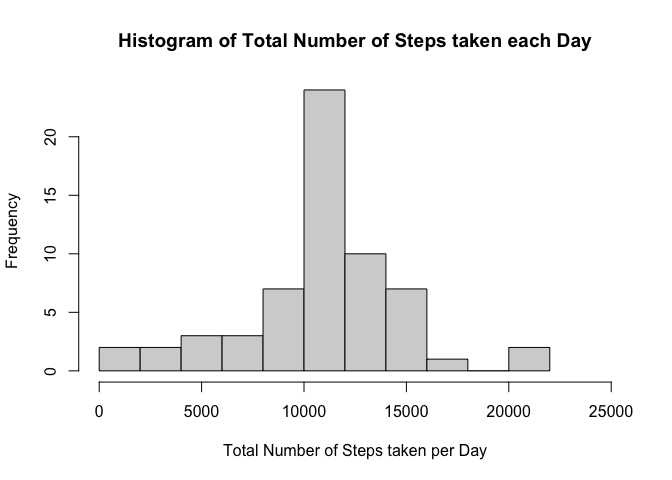
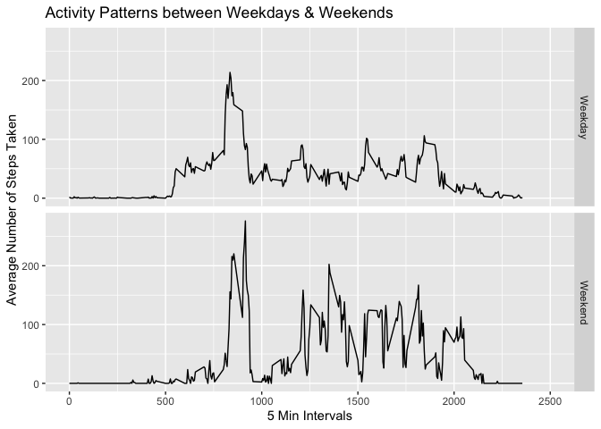

  
####Calling ggplot2 function

```r
library(ggplot2)
```

  
## Loading and preprocessing the data

  

```r
activity_data <- read.csv("./activity.csv", na.strings = "NA")
```
####Change class of dates in activity data from character to Date

```r
activity_data$date <- as.Date(activity_data$date, format = "%Y-%m-%d")
original_data <- activity_data
```

  
## What is mean total number of steps taken per day?

  
####Group the steps' data by date using sum

```r
group_data <- aggregate(x = activity_data$steps, 
                        by = list(activity_data$date), 
                        FUN = sum, na.rm = TRUE)
```

####Plotting a histogram of Total Number of Steps taken each Day

```r
with(group_data, 
     hist(x = x, 
          breaks = 10, 
          xlim = c(0,25000), 
          main = "Histogram of Total Number of Steps taken each Day", 
          xlab = "Total Number of Steps taken per Day"))
```

<!-- -->

####Calculating mean and median of the total number of steps taken per day

```r
Mean <- mean(group_data$x, na.rm = TRUE)
Mean
```

```
## [1] 9354.23
```

```r
Median <- median(group_data$x, na.rm = TRUE)
Median
```

```
## [1] 10395
```

  
## What is the average daily activity pattern?

  
####Group the steps' data by interval using mean

```r
group_interval <- aggregate(x = activity_data$steps, 
                        by = list(activity_data$interval), 
                        FUN = mean, na.rm = TRUE)
```

####Plotting the time series graph for Average Daily Activity Pattern

```r
with(group_interval,
     plot(x = Group.1, 
          y = x, type = "l", xlim = c(0,2500), 
          main = "Average Daily Activity Pattern", 
          ylab = "Average Number of Steps Taken", 
          xlab = "5 Min Intervals"))
```

<!-- -->

####Which interval has maximum number of steps?

```r
group_interval[which.max(group_interval$x),]$Group.1
```

```
## [1] 835
```

  
## Imputing missing values

  
####Number of rows where no. of steps' data is missing

```r
nrow(activity_data[is.na(activity_data$steps),])
```

```
## [1] 2304
```

####Looping through na_data for assigning values - I am here using the mean for that respective interval

```r
na_data <- activity_data[is.na(activity_data$steps),]
for(i in 1:2304) {
        na_data$steps[i] <- group_interval[group_interval$Group.1 == na_data[i,]$interval,]$x
}
```

####Replacing data with means of same interval group

```r
activity_data$steps[is.na(activity_data$steps)] <- na_data$steps
```
####Making new group, for steps' new data, by date using sum

```r
new_group <- aggregate(x = activity_data$steps, 
                       by = list(activity_data$date), 
                       FUN = sum)
```

####Plotting a histogram of Total Number of Steps taken each Day using Filled Missing Data

```r
with(new_group, 
     hist(x = x, 
          breaks = 10, 
          xlim = c(0,25000), 
          main = "Histogram of Total Number of Steps taken each Day", 
          xlab = "Total Number of Steps taken per Day"))
```

<!-- -->

####Calculating mean and median of the total number of steps taken per day of Filled Missing Data

```r
Mean2 <- mean(new_group$x)
Mean2
```

```
## [1] 10766.19
```

```r
Median2 <- median(new_group$x)
Median2
```

```
## [1] 10766.19
```
####Comparing with older data

```r
oldgroup_data <- aggregate(x = original_data$steps, 
                           by = list(original_data$date), 
                           FUN = sum, na.rm = TRUE)

Mean <- mean(oldgroup_data$x)
Mean
```

```
## [1] 9354.23
```

```r
Median <- median(oldgroup_data$x)
Median
```

```
## [1] 10395
```

  
## Are there differences in activity patterns between weekdays and weekends?

  
####Adding a variable of day using weekdays function

```r
original_data$day <- weekdays(original_data$date)
```

####Changing day variable values to two factor weekday or weekend

```r
for (i in 1:17568) {
        if (original_data$day[i] != "Saturday") {
                original_data$day[i] <- "Weekday"
        } else if (original_data$day[i] != "Sunday") {original_data$day[i] <- "Weekend"}
        else {original_data$day[i] <- "Weekend"}
}
```

####Coercing day data into factors

```r
original_data$day <- as.factor(original_data$day)
```

####Grouping by day and interval and taking mean

```r
weekday_group <- aggregate(x = original_data$steps, 
                           by = list(original_data$day, original_data$interval), 
                           FUN = mean,
                           na.rm = TRUE)
```

####Plotting a panel plot containing a time series plot of the 5-minute interval (x-axis) and the average number of steps taken, averaged across all weekday days or weekend days (y-axis)

```r
g <- ggplot(data = weekday_group, aes(x = Group.2, y = x))
g + geom_line() + 
        facet_grid(Group.1~.) + 
        labs(title = "Activity Patterns between Weekdays & Weekends") +
        xlab("5 Min Intervals") + 
        ylab("Average Number of Steps Taken") +
        coord_cartesian(xlim = c(0,2500))
```

<!-- -->

   

#####Thank You
